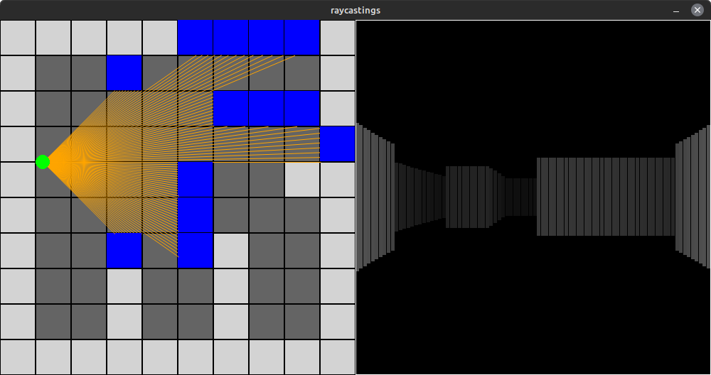
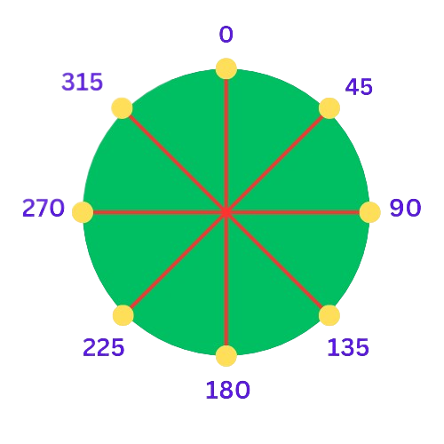

# raycastings

- [x] Python3 (+pygame as 2D graphics lib)
- [ ] C
- [ ] JavaScript




*addtional feature: I implemented a custom collison system with only using math & program logic.*
### How my custom collison system works?
here's the specific code:

```python3
#storing the previous values of the player's x & y coordinates
prev_x = player_x
prev_y = player_y

#movment code here

#the collison system
for ang in range(0,360,STEP):
  a = radians(ang)
  row = int((player_y-(RADIUS+0.5)*sin(a))/LENGTH)
  col = int((player_x-(RADIUS+0.5)*cos(a))/LENGTH)
  if MAP[row][col] == 1:
    player_x = prev_x
    player_y = prev_y
```
*this is the whole collsion system code.*
<br>
in actual code at line number:
<br>
[81-82](https://github.com/vilgacx/raycastings/blob/381caeae59115928d8328155067c9d58415f27ef/py/main.py#L81C2-L82C22) & [98-102](https://github.com/vilgacx/raycastings/blob/381caeae59115928d8328155067c9d58415f27ef/py/main.py#L98C4-L102C30)

#### What Exactly Is It Doing?

It is essentially tracking specific points along the circumference. When these points overlap with any coordinates on the "wall," the player's X and Y coordinates are reverted to their previous positions.
#### Defining Points

To define the points, I implemented a for-loop that iterates from 0 to 360, covering every possible angle in a circle, with a specified "step." In this code and example, the "step" is set to 45 degrees. Therefore, the angles it will iterate through are 0, 45, 90, 135, 180, 225, 270, and 315 degrees.

Assuming the player's (X, Y) represents the center point of the circle, you can calculate the X and Y coordinates of the points along the circumference as follows: <br>
`XPoint = X - (radius + variance) * cos(angle-in-radians)` <br>
`YPoint = Y - (radius + variance) * sin(angle-in-radians)`

The diagram below illustrates all the points on a circle, starting from 0 degrees and incrementing by45 degrees.



that's how points can be defined and then check if they overlaped.

**Pros:**
- The lesser the step value the more delicate it gets as it will track more points. Even though currently step is set to 45 degrees it still does very well job at detecting collsion.
- Pretty Errorless

**Cons:**
- Can be CPU intensive as tracking more and more points.


***I might make a video on it, explaining it even more properly***
